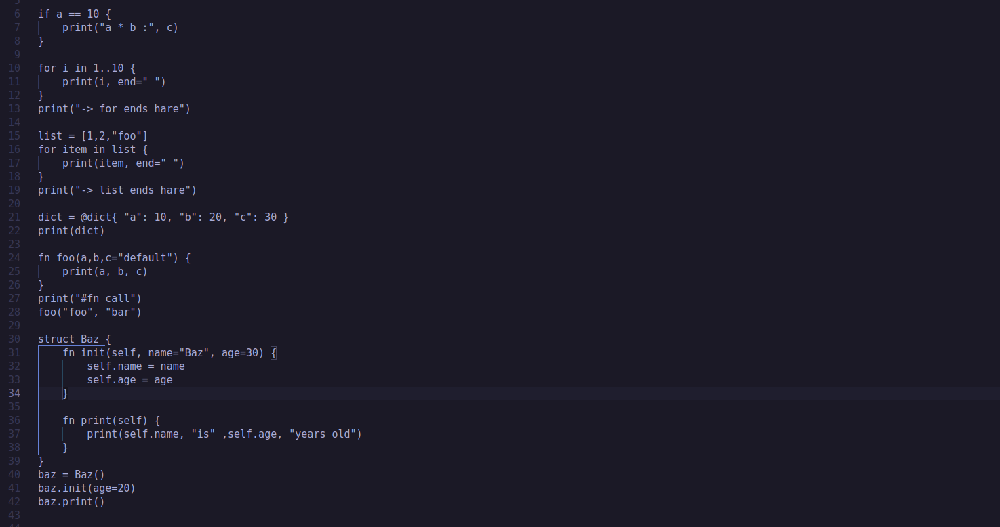
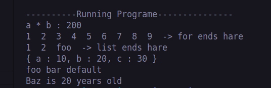
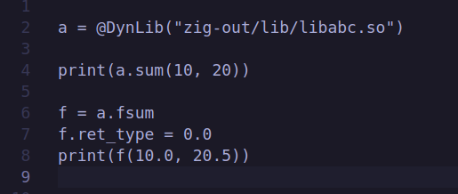
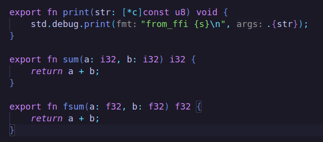
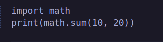
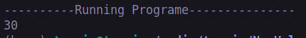

# A interpreater
A interpreater inspired by python. Support almost all the language features like python. FFI support for easily call zig functions.
Jit compilation feature os on devlopment.

# Cool Features
* FFI(Foreign Function Interface) can call zig functions directly from interpreter
* JIT(Just In Time) compilation is on devlopment

# FFI

libabc

# Module import

